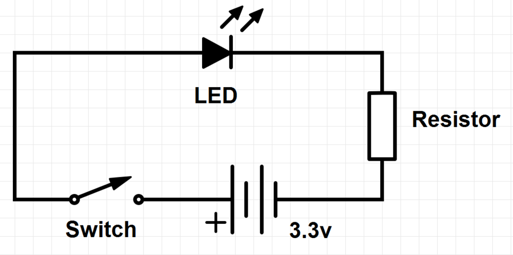
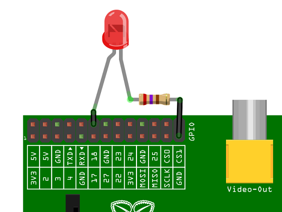

# GPIO: 模型A+,B+，树莓派2B 和树莓派3B

### 介绍GPIO和树莓派上物理计算

树莓派一个强大功能就是板子顶边上一排GPIO（通用输入输出）引脚。

这是引脚是树莓派和外部世界的物理接口。在这个简单的层面上，你可以认为他们是一个你能打开或关闭（输入）的开关，或者树莓派能开启或者关闭（输出）。40个引脚中，有26个是输入输出引脚，其他的是电源和接地引脚（有两个EEPROM引脚你最好不要动，除非你明白你在做什么）

注意，GPIO的引脚编号很奇怪，*附录1：引脚编号*将会解释原因。

## 他们是做什么的，我可以用来做什么？

你可以通过编程的方式让引脚与真实的世界进行互动。输入不必来自于一个物理开关，比如说：可以是一个传感器的输入或者是其他电脑或设备的信号。输出也可以做任何事，从开启一个LED灯，到发送一个信号或者数据到其他设备。如果树莓派联网，你可以控制连接到树莓派上的任何设备，并且那些设备可以将数据传回来。物理设备通过网络相互交流和控制是非常强大并且令人激动。树莓派就是为这而生。[我们的博客](http://www.raspberrypi.org/blog/)上有很多有关物理计算棒极了的例子

**注意**: 当然不是口头上说的那样，你还需要连接到可计算的网络设备，以及电源。请别写信告诉我们这点。

## GPIO是怎么工作的

### 输出
**注意**：如果你参照下面的指令，就能体会到GPIO是安全的并且非常有趣。随机地插线让电流接触到你的树莓派，可能会烧坏树莓派。坏的事情也可能会发生，比如一些设备从树莓派耗费了大量的电源。LED二极管是没问题的，但是电动机就不行。如果你担心这些，你可能需要考虑使用一个外接的洞洞板[Pibrella](http://pibrella.com/)直到你确信你能直接使用GPIO。

忽略树莓派一会儿。一个最简单的电子实验就是有一个由电池，开关让灯泡亮的实验（电阻是为了保护LED的）

我们可以使用一个GPIO作为一个输出，树莓派同时替代了开关和电池的角色，如上图。每一个引脚可以开或者关，电压可以是高或者低。当为高的时候输出3.3V低的时候就是关闭。

下面是一个在树莓派上的相同的电路。GPIO连接到LED引脚（能够输出3.3V电压）和地(充当电源的负极)，

下一步是写一点代码告诉树莓派控制引脚的高低电平。这里有一个[Python](http://www.raspberrypi.org/learning/quick-reaction-game/)实例（看步骤2）,这里怎么在[Scratch](http://www.raspberrypi.org/learning/robot-antenna/)中用。

### 输入

GPIO的**输出*非常容易，就是开关或者电平的高低，3.3V或0V. 由于电子设备的工作方式，**输入**就有一些棘手了。尽管似乎将开关的一端连接到一个输入引脚另一个接地是合理的，但对于树莓派来说依然困惑：开关到底是开着的还是关闭的。它可能工作，也可能不工作。这有点像在太空中漂浮，由于没有参考，所以很难判断是在往上还是往下，甚至没有上下的概念。

这就是你可能在树莓派GPIO教程中看到''上拉''或者''下拉''的原因。一个方法是给输入引脚一个参考电平，这样树莓派就能判断收到的信号了。

如果你想立即用GPIO作为一个输入的话，你可以看看我们的[burping jelly baby](https://www.raspberrypi.org/learning/burping-jelly-baby/) 和 [quick reaction game](http://www.raspberrypi.org/learning/quick-reaction-game/) Python教程。或者[reaction game](http://www.raspberrypi.org/learning/reaction-game/) Scratch教程.

## 结束：开始一些了不起的事吧

我们系统通过这来鼓励你来尝试用树莓派的GPIO来物理计算，它真的没有你看上去的那么艰难。仅仅需要一个简单的LED发光二极管，但是却能让你难以置信。不要低估其中的乐趣，你能从一个小小的电脑和一排引脚得到创造力和成就感。享受吧，如果你做了一些很酷的东西，请让我们知道吧。

---

## 词汇

### GPIO

通用的输入输出功能。这里具体指树莓派上你可以操纵的引脚。这么称呼是由于你可以用它来做任何你想做的东西。大多数引脚即可以作为输入，还可以作为输出，取决于你的程序。

### LED

发光二极管，在电子技术中常用的小的，低电压的发光源。是树莓派上理想的物理计算的入门介绍。

### 物理计算

计算涉及到连接到电脑上的有形的东西，除了标准的输入输出设备比如键盘、显示器，想想开关、灯泡、机器人、警报、传感器、家庭自动化、被称为Babbage在近空间的泰迪熊等等。我们喜欢物理计算因为有许许多多的乐趣。有强大的教学和学习工具，鼓励创造性、解决问题的能力以及合作精神。屏幕背后的计算鼓励这所有年龄的小孩，你们都能做出很酷的东西。

---

## 附录1： 注意引脚编号

当用GPIO引脚来来编程时，有两种不同指代方式。GPIO的编号和物理上的编号。

#### GPIO编号

这些GPIO引脚是作为电脑可见的。这些号码对人来说咩有任何意义，在空间上是不连续的，所以也不容易记住。你需要一个可打印的或者板载的参考来指明这些引脚。

#### 物理编号

另一种指明这些引脚的方式是简单地通过板子上引脚的位置来计数，从顶部的左端（靠近SD的一端）开始记为引脚1，这种物理编号的方式如下：

#### 我该使用哪种编号方式？

对于初学者或者小朋友来说物理编号的方式更加简单-你只需要简单地数引脚。但你仍然需要一个更上面一样的图来明白引脚的位置，那些是电源，那些是地。

通常我们推荐使用GPIO的编号方式，它很好实践并且大多数的资源都是使用这种方式。任意挑选一种方式，只要在程序中使用相同的系统，一切都没问题。注意引脚编号也依赖于你所使用的变成语言，比如：Scratch GPIO 使用物理编号，但在Python中可以挑选使用。

查看更多详细的GPIO高级功能，请看gadgetoid的 [生动的引脚排列图](http://pinout.xyz/)。
