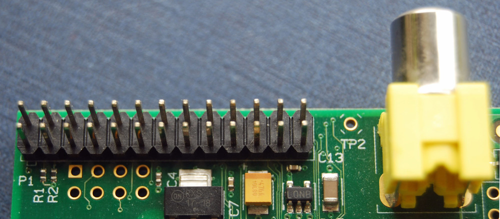

# GPIO: 树莓派 Models A and B

### 介绍树莓派的GPIO以及物理上的接口

树莓派一个强大的功能就是就是那一排GPIO（通用的输入输出口）引脚，在板子的黄色视频输出口旁边。

这是引脚是树莓派连接了物理接口和外部世界。举一个简单例子，你可以把它想象成一个开关可以开启或者关闭(输入或者输出)。26个引脚中有17个是GPIO引脚，其他的是电源和接地。

## 他们是为什么而生？我能用他们做什么？

可以通过编程指令以令人惊讶的形式来控制真实的世界。输入不必需要一个物理的开关，可以通过一个传感器或者其他的电脑或者其他设备。输出也可以做各种东西，可以从打开一个LED灯来给另一个设备发送信号或者数据。如果树莓派联网，你可以控制在任何地方的任何设备，只要这些地方能够将数据发送回来。通过互联网相互交流和控制物理设备是一件很强大和喜欢的事情，树莓派就是做这样的一件事儿。在我们的[博客](http://www.raspberrypi.org/blog/)上有许多的关于这些方面的教程。

**注意**:  当然不是字面上的意思。你需要设备连接到网络，一个通上电的可联网的设备。请不要指出我们这里写错了。

## GPIO是怎样工作的

### 输出

**注意**：如果你参照下面的指令，就能体会到GPIO是安全的并且非常有趣。随机地插线让电流接触到你的树莓派，可能会烧坏树莓派。坏的事情也可能会发生，比如一些设备从树莓派耗费了大量的电源。LED二极管是没问题的，但是电动机就不行。如果你担心这些，你可能需要考虑使用一个外接的洞洞板[Pibrella](http://pibrella.com/)直到你确信你能直接使用GPIO。

忽略树莓派一会儿。一个最简单的电子实验就是有一个由电池，开关让灯泡亮的实验（电阻是为了保护LED的）

我们可以使用一个GPIO作为一个输出，树莓派同时替代了开关和电池的角色，如上图。每一个引脚可以开或者关，电压可以是高或者低。当为高的时候输出3.3V低的时候就是关闭。

下面是一个在树莓派上的相同的电路。GPIO连接到LED引脚（能够输出3.3V电压）和地(充当电源的负极)，

下一步是写一点代码告诉树莓派控制引脚的高低电平。这里有一个[Python](http://www.raspberrypi.org/learning/quick-reaction-game/)实例（看步骤2）,这里怎么在[Scratch](http://www.raspberrypi.org/learning/robot-antenna/)中用。
