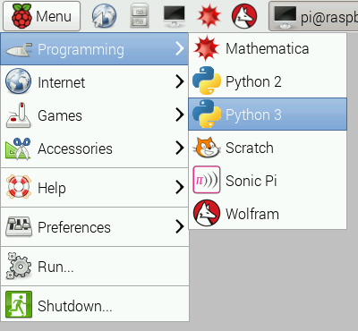
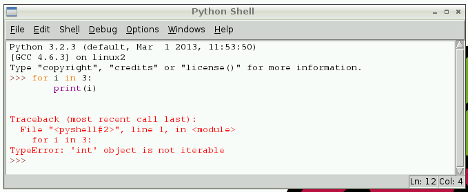
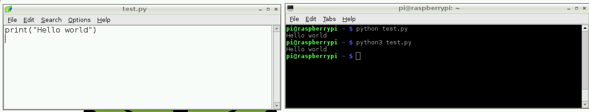

# Python

Python is a wonderful and powerful programming language that's easy to use (easy to read **and** write) and with Raspberry Pi lets you connect your project to the real world.
Python 是一款强大而又优雅的编程语言，它非常容易使用-包括读和写。在树莓派上通过Python将你的项目与真实的世界相连。


Python syntax is very clean, with an emphasis on readability and uses standard English keywords. Start by opening IDLE from the desktop.
Python 语法非常简洁，它强调使用标准的英语单词来增强可读性。通过桌面的IDLE程序即可开始。

## IDLE

The easiest introduction to Python is through IDLE, a Python development environment. Open IDLE from the Desktop or applications menu:
介绍Python最简单的方式就是通过IDLE-Python开发环境。从桌面或者从应用程序菜单打开IDLE.



IDLE gives you a REPL (Read-Evaluate-Print-Loop) which is a prompt you can enter Python commands in to. As it's a REPL you even get the output of commands printed to the screen without using `print`.
IDLE 通过你输入的Python命令提供了一个REPL(读取-求值-打印-循环)。作为一个REPL，你甚至不需要使用`print`命令就可以将命令的结果输出出来。

*Note two versions of Python are available: Python 2 and Python 3. Python 3 is the newest version and is recommended, however Python 2 is available for legacy applications which do not support Python 3 yet. For the examples on this page you can use Python 2 or 3 (see [Python 2 vs. Python 3](more.md)).*
*注意：有两个版本的Python都可用，Python2和Python3。Python3是最新的版本，推荐使用Python3。但是Python2对一些遗留的不支持Python3的应用程序依然可用。比如在这一页你可以使用Python2或者Python3(see [Python 2 vs. Python 3](more.md)).*

You can use variables if you need to but you can even use it like a calculator. For example:
如果需要的话，你可以使用变量，当然你也可以像计算器一样使用，比如说：

```python
>>> 1 + 2
3
>>> name = "Sarah"
>>> "Hello " + name
'Hello Sarah'
```

IDLE also has syntax highlighting built in and some support for autocompletion. You can look back on the history of the commands you've entered in the REPL with `Alt + P` (previous) and `Alt + N` (next).
IDLE也支持语法高亮和自动补全代码的功能。你可以使用历史命令在REPL中通过 `Alt + P` (向前) 以及 `Alt + N` (向后)。

## Basic Python usage
## Python基本使用

Hello world in Python:
在python中打印Hello world:

```python
print("Hello world")
```

Simple as that!
如此之简单。

### Indentation
### 缩进

Some languages use curly braces `{` and `}` to wrap around lines of code which belong together, and leave it to the writer to indent these lines to appear visually nested. However, Python does not use curly braces but instead requires indentation for nesting. For example a `for` loop in Python:
一些语言使用大括号 `{` 和 `}` 将属于一起的多行代码包装起来，让写出来的这些行缩进看起来是视觉上的嵌套。但是Python使用缩进而不是大括号来表示代码段。比如Python中的一个`for`循环：

```python
for i in range(10):
    print("Hello")
```

The indentation is necessary here. A second line indented would be a part of the loop, and a second line not indented would be outside of the loop. For example:
这里是必须要缩进的。第二行的缩进将是循环的一部分，如果第二行不缩进，将是循环外的一部分，比如：

```python
for i in range(2):
    print("A")
    print("B")
```

would print:
将会打印：

```
A
B
A
B
```

whereas the following:
再比如：

```python
for i in range(2):
    print("A")
print("B")
```

would print:
将会打印：

```
A
A
B
```

### Variables
### 变量

To save a value to a variable, assign it like so:
可以像这样给一个变量赋值：

```python
name = "Bob"
age = 15
```

Note here I did not assign types to these variables, as types are inferred, and can be changed (it's dynamic).
注意这里没有给变量设置类型，变量的类型是被推倒出来的，也可以被改变（变量的类型是动态的）。

```python
age = 15
age += 1  # increment age by 1
print(age)
```

This time I used comments beside the increment command.
现在我将在命令旁边注释

### Comments
### 注释

Comments are ignored in the program but there for you to leave notes, and are denoted by the hash `#` symbol. Multi-line comments use triple quotes like so:
注释在程序中将被忽略，但是你可以用来备注，使用`#`符号来表示备注，多行注释使用三引号：

```python
"""
This is a very simple Python program that prints "Hello".
That's all it does.
"""

print("Hello")
```

### Lists
### 列表

Python also has lists (called arrays in some languages) which are collections of data of any type:
Python也拥有列表(在一些语言中称为数组),但是可以存储任意数据类型：

```python
numbers = [1, 2, 3]
```

Lists are denoted by the use of square brackets `[]` and each item is separated by a comma.
列表使用中括号`[]`表示，每项使用逗号分开：

### Iteration
### 迭代器

Some data types are iterable, which means you can loop over the values they contain. For example a list:
有些迭代器类型，意味着你可以遍历他们的值，比如对于一个列表来说：

```python
numbers = [1, 2, 3]

for number in numbers:
    print(number)
```

This takes each item in the list `numbers` and prints out the item:
这将会打印出这个列表中的每一项`number`：

```
1
2
3
```

Note I used the word `number` to denote each item. This is merely the word I chose for this - it's recommended you choose descriptive words for variables - using plurals for lists, and singular for each item makes sense. It makes it easier to understand when reading.
注意我使用`number`来表示每一项。仅仅是我选择的单词来表达。推荐你选择变量的具体含义，列表使用复数，列表中的每项使用单数来表示。这将更加容易阅读。

Other data types are iterable, for example the string:
其他数据类型的迭代器，比如字符串：

```python
dog_name = "BINGO"

for char in dog_name:
    print(char)
```

This loops over each character and prints them out:
这个将会遍历单词的每个字母，打印如下：

```
B
I
N
G
O
```

### Range
### 范围

The integer data type is not iterable and tryng to iterate over it will produce an error. For example:
整数类型不可迭代，尝试迭代将会抛出一个错误，比如：

```python
for i in 3:
    print(i)
```

will produce:
将会产生错误：

```python
TypeError: 'int' object is not iterable
```



However you can make an iterable object using the `range` function:
但是你可以使用`range`函数来产生一个迭代器对象：

```python
for i in range(3):
    print(i)
```

`range(5)` contains the numbers `0`, `1`, `2`, `3` and `4` (five numbers in total). To get the numbers `1` to `5` use `range(1, 6)`.
`range(5)` 包含数字`0`,`1`,`2`,`3`,`4`(一共五个数字)。为了获得`1`到`5`的范围可以使用`range(1,6)`:

### Length
### 长度

You can use functions like `len` to find the length of a string or a list:
你可以使用`len`函数来计算字符串或者列表的长度：

```python
name = "Jamie"
print(len(name))  # 5

names = ["Bob", "Jane", "James", "Alice"]
print(len(names))  # 4
```

### If statements
### If 条件判断

You can use `if` statements for control flow:
你可以使用`if`来控制程序的流程：

```python
name = "Joe"

if len(name) > 3:
    print("Nice name,")
    print(name)
else:
    print("That's a short name,")
    print(name)
```

## Python files in IDLE
## IDLE中Python文件

To create a Python file in IDLE, click `File > New File` and you'll be given a blank window. This is an empty file, not a Python prompt. You write a Python file in this window, save it, then run it and you'll see the output in the other window.
为了在IDEL中创建一个Python文件，单击`File > New File` 将会弹出一个空白窗口，这是一个空的文件.你可以在这个窗口中写Python文件，保存，然后运行，在另一个窗口中就能看到输出：

For example, in the new window, type:
比如在新的窗口，输入：

```python
n = 0

for i in range(1, 101):
    n += i

print("The sum of the numbers 1 to 100 is:")
print(n)
```

Then save this file (`File > Save` or `Ctrl + S`) and run (`Run > Run Module` or hit `F5`) and you'll see the output in your original Python window.
保存文件（`File > Save` 或者 `Ctrl + S`) 然后运行（`Run > Run Module` 或者 单击 `F5`) ,你就可以在原始的窗口中看到输出结果。

## Executing Python files from the command line
## 从命令行执行Python文件

You can write a Python file in a standard [editor](../../linux/usage/text-editors.md) like Vim, Nano or LeafPad, and run it as a Python script from the command line. Just navigate to the directory the file is saved (use `cd` and `ls` for guidance) and run with `python`, e.g. `python hello.py`.
你可以使用一个标准的[编辑器](../../linux/usage/text-editors.md) 比如 Vim,Nano,LeafPad，然后从命令行运行Python脚本。进入到保存(使用`cd` 以及`ls`指导)Python文件的目录，然后使用`Python`运行，比如`python hello.py`.



## More
## 更多

See [more advanced](more.md) information covering:
查看[更多](more.md)信息：

- Python 2 vs. Python 3
- Python 2 与 Python 3对比
- Convention
- 约定
- Other ways of using Python
- 其他使用Python的方法
- Installing Python libraries
- 安装Python库
- GPIO

Also see the page on running the preinstalled [Python Games](../python-games/README.md)
也可以查看预装页面[Python Games](../python-games/README.md)

## Python Documentation
## Python 文档

Full documentation for Python is available at [python.org/doc](https://www.python.org/doc/)
完整Python文档参考[python.org/doc](https://www.python.org/doc/)
