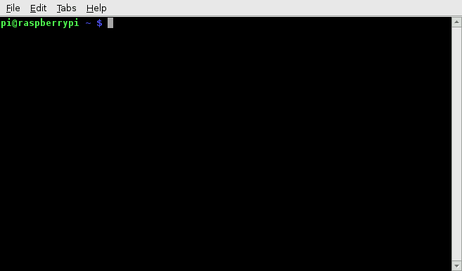
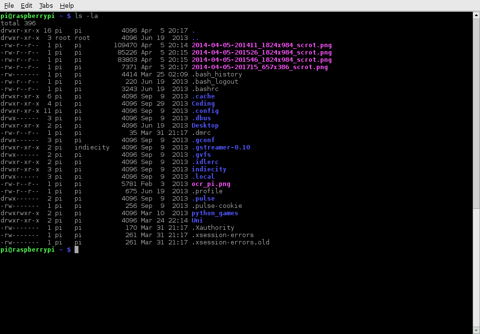

# 终端

电脑上的终端(或者称为命令行)允许用户在很大的程度上控制我们的系统(这里就是我们的树莓派)。Windows用户可能接触过`Command Prompt`或者`Powershell`，Mac OS用户可能更加熟悉`Terminal`。所有的这些工具允许用户使用命令行的方式直接操控他们的系统。这些命令可能会链接在一起和/或组合在一起来形成脚本(查看 [Linux脚本使用](../../linux/usage/scripting.md)) 比传统的软件包更加有效地完成任务。

## 开始LXTerminal

在树莓派中(运行Raspbian系统)，默认的终端程序是`LXTerminal`,这是一个比较知名的终端模拟器，意思是它可以在图形化界面中模拟旧样式的视频终端(在图形化界面应用接口被开发出来以前)。这个应用程序在树莓派的桌面，启动后如下图所示：



你应该能够看到如下的提示：

```bash
pi@raspberrypi ~ $
```

这显示了你的树莓派用户名和域名，这里用户名是`pi`，域名是`raspberrypi`。

现在，让我们试着运行一条命令。输入`pwd`(当前工作的目录)，然后按下`Enter`键。

## 导航和浏览你的树莓派

使用终端的一个重要的方面就是显示你的文件系统，运行如下的命令:`ls -al`，你应该能看到类似下面的页面：



`ls`命令列举了你当前目录小的所有内容。`-al`是命令的一个标签的一部分。标志修改正在运行的命令。`l`是代表展示当前目录的列表，显示文件的大小以及最后修改时间。`a`显示所有的文件，包括以`.`开头的隐藏文件。'点'文件经常作为一个软件的配置，他们是以文本文档来写的，他们能够很容易被编辑。

为了跳转到其他的目录，可以使用'cd'命令。你可以指定绝对路径或者相对路径。如果你想导航到 `python_games`目录，你一个编辑`cd /home/pi/python_games` 或者仅仅`cd python_games`(如果当前在`/home/pi`目录)然后执行。有一些特殊的有用的标记：`~`是你自己根目录的别名，所以`~/python_games`等同于`/home/pi/python_games`。`.`和`..`分别表示当前目录和上层目录。如果你在`/home/pi/python_games`,`cd ..`将会带你到`/home/pi`目录。

## 历史消息和自动补全

相比于输入每条命令，终端可以通过键盘上下方向键来跳转到之前的命令。如果你在命令中输入一个文件或目录名的一部分，敲击键盘`tab`键将自动补全你想要输入的。比如在你的目录中有一个文件叫做`aLongFileName`,在输入`a`之后敲击`tab`,将会在当前目录中所有的文件和目录名匹配以`a`开头的，然后你可以选择`aLongFileName`

## Sudo

有些命令会永久地改变系统的状态，所以需要系统的管理权限，`sudo`提供这样的能力(如果你没有以`root`帐号来登录)来运行你的命令，前提是你的用户名在(`sudoers`)组中。当你在命令的前面加了`sudo`然后`enter`，你将会被要求输入密码，当密码正确的时候，你的命令就是以root权限来运行的。注意：有些需要`sudo`的命令可能会给你的系统造成无法挽回的损害。

更多关于`sudo`以及root用户的信息参考[linux root page](../../linux/usage/root.md)。

## 通过apt-get安装软件

除了在树莓派上商店下载新的软件，你也可以使用 `apt-get`命令。这是一个软件包管理工具，包含在Debian发行版(包括Raspbian)。它允许你在树莓派上安装和管理新的软件。为了安装一个新的安装包你可能会输入`sudo apt-get install <package-name>` `<package-name>`是你想安装的软件包的名字。运行`sudo apt-get update`将会更新你系统上可用的软件列表。如果有新的版本可用的时候，你可以使用`sudo apt-get upgrade`来将你的就的安装包升级到新的版本。最后`sudo apt-get remove <package-name>`是从你的系统卸载或者移除一个软件包。

更多关于这类信息可以参考[linux usage section on apt](../../linux/software/apt.md)

## 其他有用的命令

有一些其他比较常用的命令列举如下：

- `cp` 复制一个文件放入到指定的位置(基本上就是粘贴复制)，比如：`cp file_a /home/other_user/`将会吧`file_a`从你的目录复制到`other_user`(将设你有权复制)目录下。注意：如果目标是一个目录，文件名依然是相同的，但是如果目标是一个文件，将会给文件新的名字。
- `mv` 将目录移动到指定的位置(cp意思是`copy-paste`,`mv`是`cut-paste`)。用法跟`cp`类似，`mv file_a /home/other_user/`就是将文件`file_a`从你的目录中移动到其他目录.`mv`还可以重命名一个文件，将它移动到新的指定的位置。
- `rm` 删除指定的文件(如果是目录要加`-r`),这删除文件的方式将不会保存的。
- `mkdir`: 创建一个新的目录，`mkdir new_dir`在当前目录将会创建一个目录名`new_dir`的目录
_ `cat` 列举当前文件的内容，`cat some_file`将会显示`some_file. _ cat`的内容。

其他的你可能发现[commands page](../../linux/usage/commands.md)会有很多用处。

## 找到一个命令的说明

为了找到一个命令更多的信息，你可以使用`man`命令就可以知道更多(比如：`man ls`)。关于这条命令的说明就会显示，包括命令参数的说明和功能，以及使用示例。